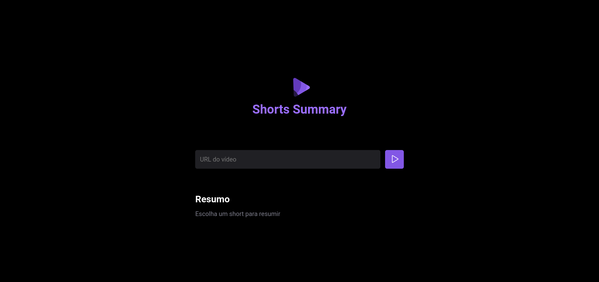

# Projeto NLW IA

### Este é um projeto realizado durante os estudos da NLW IA e o intuito dassa aplicação é fazer resumos de vídeos shots do youtube.

## Passos para rodar a aplicação

- Faça o clone do projeto rodando o seguinte comando:
    `git clone https://github.com/amandandrad/nlwia.git`

- Instale as depedências
    `npm install`

- Rode o servidor
   `npm run server`

- Rode a aplicação
    `npm run web`

- Acesse http://localhost:5173

- Cole uma URL válida de um vídeo shot (até 60 segundos) e dê play

### Contato para dúvidas ou orientações

### Projeto criado por Rodrigo Gonçalves - Instrutor Rocketseat
